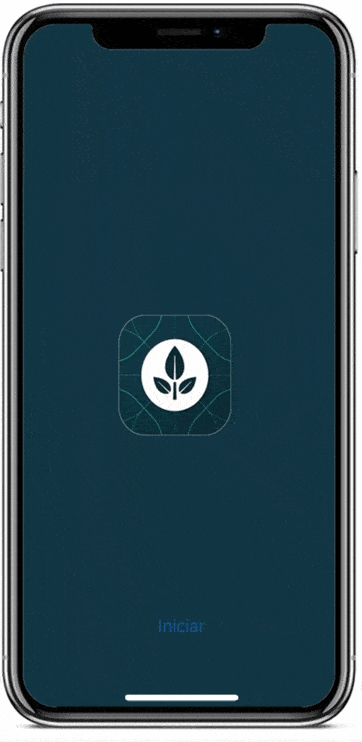

# EVA (Ecología Vital Autosustentable) 

## Descripción 
¡Nos preocupamos de tu reciclaje por ti!
Sean ya, plásticos, latas, electrónicos, orgánico o inorgánico, ya no te preocupes, nosotros te cubrimos.
Recibe el servicio de recolección de reciclaje en tu casa, y ve el seguimiento hasta el centro de acopio. Basta sólo con especificar tu reciclaje, hacer el pedido en la app, y listo.
¡Nuestros puntuales recogedores estarán afuera de tu hogar listos para llevar tu reciclaje a donde pertenece!.

## Prototipo  

## Más información en <a href="https://appeva.co" target="_blank">AppEva.co</a>.

